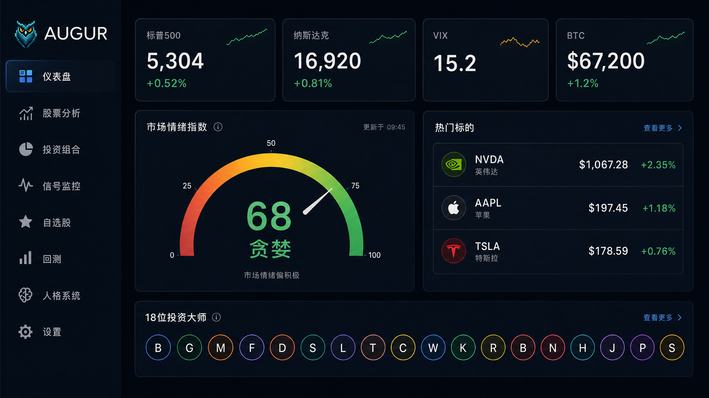
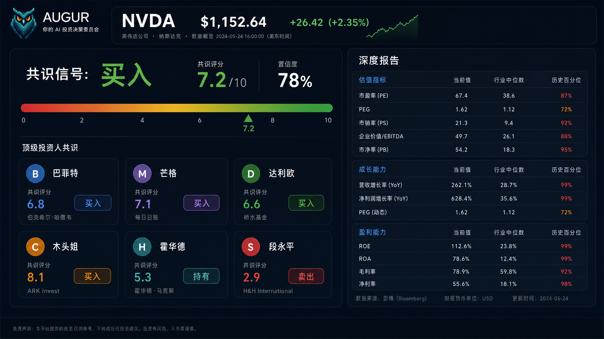
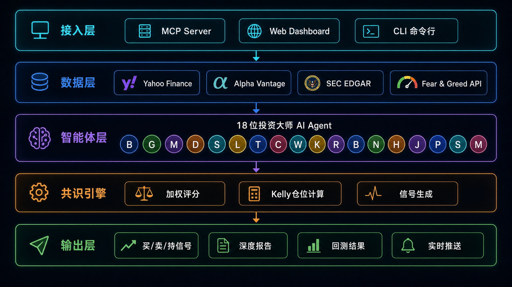
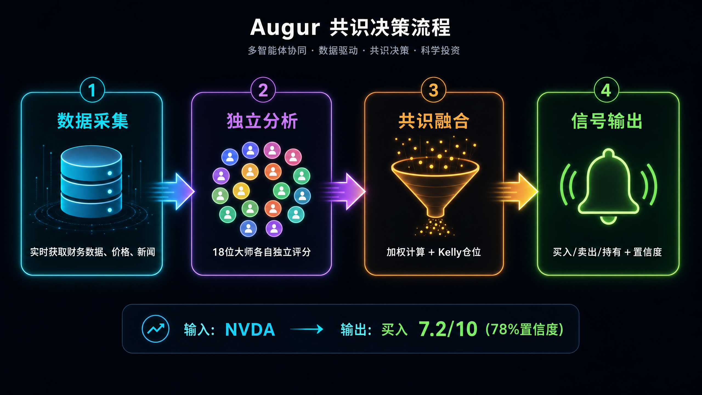
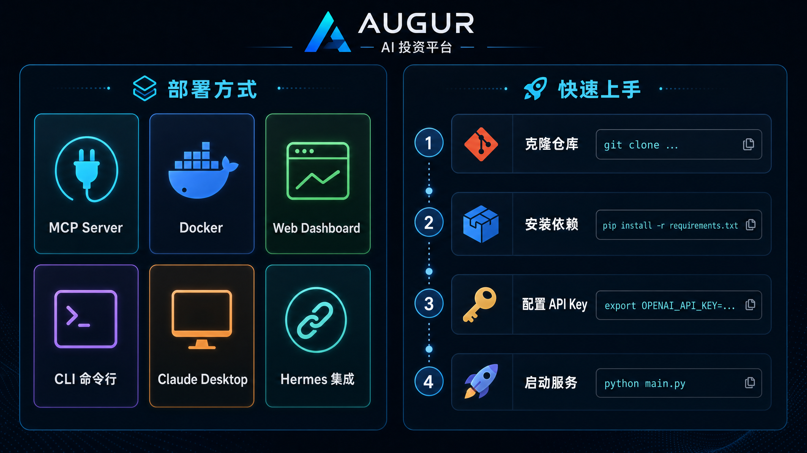

中文 | [English](README_EN.md)

<div align="center">


# 🦉 Augur

**你的 AI 投资决策委员会**

*18位投资大师，同时分析，一次共识*

[](https://github.com/BruceLanLan/augur)
[](#18位投资大师)
[](https://python.org)
[](https://modelcontextprotocol.io)
[](LICENSE)

</div>

---

> **巴菲特会买这只股吗？达利欧怎么看宏观风险？段永平觉得管理层够不够「本分」？**
>
> 真正重要的不是单一视角的分析，而是多维度的共识。Augur 让 **18位** 顶级投资人同时为你分析，每人给出独立评分，最终汇成一个带 Kelly 仓位建议的加权共识信号。它不是单纯的股票分析工具，更像是一层基于大师智慧的投资风控系统。

---

> **🦉 为什么是白色像素猫头鹰？**
> 在日本文化中，白色猫头鹰（フクロウ）是招财和智慧的象征。「フクロウ」的发音可以拆解为「不苦労」（没有辛苦）或「福来郎」（福气到来）。我们选择白色像素猫头鹰作为 Augur 的 Logo，寓意着：**用 AI 的智慧，让投资决策少一点辛苦，多一点回报。**

## 💡 为什么是 Augur？

| 维度 | 传统单策略 | ChatGPT 问答 | **Augur** |
| :--- | :---: | :---: | :---: |
| **分析视角** | 1 种 | 随机/通用 | **18 种独立投资流派** |
| **量化评分** | ✗ | ✗ | **0-10 结构化独立打分** |
| **中国投资人** | ✗ | 有偏见/缺乏深度 | **段永平/张磊/李录/但斌** |
| **实时数据** | 手动输入 | 无/滞后 | **yfinance 自动获取** |
| **仓位建议** | ✗ | ✗ | **Kelly 公式动态计算** |
| **系统集成** | ✗ | ✗ | **MCP Server / Hermes 接入** |

---

## 🧠 18位投资大师

<details>
<summary><strong>经典价值派</strong>（点击展开）</summary>

| 投资人 | 核心框架 | 最强场景 |
|--------|---------|---------|
| 🏆 **巴菲特** | 护城河 + 可预测盈利 + FCF | 消费/金融蓝筹 |
| 📐 **格雷厄姆** | 安全边际 PE<15 PB<1.5 | 深度价值股 |
| 🧠 **芒格** | 格栅思维 + 逆向 | 被市场误解的企业 |
| 🔬 **费雪** | Scuttlebutt + 毛利率持续性 | 成长型高质量公司 |

</details>

<details>
<summary><strong>成长与创新</strong></summary>

| 投资人 | 核心框架 | 最强场景 |
|--------|---------|---------|
| 🚀 **彼得林奇** | PEG < 1.5 + 日常可理解 | GARP 成长股 |
| 💡 **凯西伍德** | Wright定律 + TAM扩张 | AI/基因组/区块链 |
| 🏢 **彼得蒂尔** | 0→1 垄断 + 逆向思考 | 科技平台/深科技 |
| 🤖 **阿申布伦纳** | AGI基础设施 + 算力稀缺 | AI/半导体 |

</details>

<details>
<summary><strong>宏观与周期</strong></summary>

| 投资人 | 核心框架 | 最强场景 |
|--------|---------|---------|
| 🌐 **达利欧** | 全天候 + 债务周期 | 宏观轮动 |
| 🔄 **索罗斯** | 反射性 + 趋势自我强化 | 趋势交易 |
| 📉 **霍华德马克斯** | 钟摆情绪 + 二阶思考 | 周期底部 |
| 🥇 **ARPS** | 实际利率 + Crypto/黄金 | 通胀对冲 |

</details>

<details>
<summary><strong>🇨🇳 中国投资人（独家）</strong></summary>

| 投资人 | 核心框架 | 最强场景 |
|--------|---------|---------|
| 🎯 **段永平** | 本分 + 极度集中 | 商业模式清晰的消费科技 |
| 🌏 **张磊（高瓴）** | 结构性长期价值 | 中国成长赛道 |
| 🏔️ **李录（喜马拉雅）** | 深度价值 + 安全边际 | 港股/A股低估值 |
| 🫖 **但斌（东方港湾）** | 品牌护城河 + 时代Beta | 消费龙头 |
| ₿ **大宇（BTCdayu）** | 信息差 + 情绪动量 | Crypto/加密赛道 |

</details>

<details>
<summary><strong>前沿特殊策略</strong></summary>

| 投资人 | 核心框架 | 最强场景 |
|--------|---------|---------|
| 🔭 **Serenity** | AI/半导体供应链瓶颈 | 卡脖子环节标的 |

</details>

---

## 🚀 30秒上手

```bash
git clone https://github.com/BruceLanLan/augur.git && cd augur

# 创建虚拟环境并升级 pip（解决旧版本兼容问题）
python3 -m venv .venv && source .venv/bin/activate
pip install --upgrade pip setuptools wheel

# 安装 Augur
pip install -e ".[data]"

# 开始使用
augur analyze AAPL         # 一键分析，自动获取实时数据
augur consensus NVDA       # 18位共识 + Kelly仓位
augur report TSLA          # 生成深度分析报告
python3 -m dashboard.app   # 启动 Bloomberg 风格 Dashboard
# → 浏览器打开 http://localhost:8000
```

---

## ✨ 真实运行效果

```text
$ augur analyze NVDA

Auto-fetching data for NVDA from yfinance...
  Price: 820.00 | PE: 45.0 | ROE: 65.0% | GM: 78.0%

━━━━━━━━━━━━━━━━━━━━━━━━━━━━━━━━━━━━━━━━━━━━━━
  NVDA — 18 Masters Consensus
━━━━━━━━━━━━━━━━━━━━━━━━━━━━━━━━━━━━━━━━━━━━━━
  Signal:     BULLISH
  Score:      7.6 / 10
  Confidence: 82%
  Kelly Size: 9.2%

  Key Findings:
    • 🛡️ AI reinforcing moat, competitive advantage expanding
    • ⚡ AI revenue rapidly growing, clear AGI commercialisation
    • 🚀 Revenue 122%, S-curve early rapid expansion phase

  BULLISH (11): buffett, fisher, aschenbrenner, cathie_wood, thiel...
  NEUTRAL  (5): dalio, marks, graham, soros, serenity
  BEARISH  (2): arps, munger
━━━━━━━━━━━━━━━━━━━━━━━━━━━━━━━━━━━━━━━━━━━━━━
```

---

## 📊 Bloomberg 风格 Dashboard

```bash
python3 -m dashboard.app --port 8000 --cors
```

Bloomberg Terminal 风格，**9个页面**，完整分析流程：

| 页面 | 功能 | 亮点 |
|------|------|------|
| **首页** | 快速分析 + 数据源状态 + 热门标的 | 键盘 `/` 快速聚焦，响应式移动布局 |
| **股票分析** | 18位共识 + 可视化报告 | 评分卡片网格 + 多空辩论 + 风险矩阵 |
| **人格系统** | 18位大师卡片 + 搜索/过滤 | 展开看评分权重，Ask Question + Compare |
| **信号监控** | 自选股批量扫描 | 自动 60s 刷新 |
| **持仓管理** | 持仓追踪 + 实时盈亏 + 资产配置图 | /portfolio，localStorage 持久化 |
| **分析报告** | 全页专业报告 + 下载 | /report/{ticker}，MD/HTML 下载 |
| **历史回测** | IC 排行榜 + 命中率 | 评估大师准确率 |
| **设置** | 每位大师独立配置模型 | 实时保存 |
| **创建大师** | 无代码 YAML 自定义 | 即时注册生效 |

<p align="center">
  
</p>

<p align="center">
  
</p>

---

## 🔌 架构与多平台部署

Augur 支持无缝接入主流 AI Agent 平台，让投资决策融入你的日常工作流。

<p align="center">
  
</p>

### 共识机制流程

<p align="center">
  
</p>

### 一键部署

<p align="center">
  
</p>

### Claude Desktop / Hermes (MCP)

```bash
# Step 1: 安装 MCP 支持 (需要 Python 3.10+)
uv venv --python 3.11 .venv
uv pip install -e ".[mcp]"
.venv/bin/augur mcp-server   # 验证可启动
```

---

## 📝 版本更新日志 (Recent Updates)

<details>
<summary><strong>v8.0.0 智能投资平台升级 (最新)</strong></summary>

| 功能 | 说明 |
|------|------|
| 💬 AI 对话 | `/chat` — 11位大师独特语气模板对话，无需 LLM API |
| 📊 组合优化 | `/optimizer` — Markowitz 有效前沿（纯Python，无numpy依赖） |
| ⚔️ 大师对决 | `/compare` — 选 2-5 位大师对同一股票独立分析对比 |
| 🗣️ 辩论模式 | `/debate` — 多大师辩论，顺序反驳，生成辩论摘要 |
| 📜 历史记录 | `/history` — 分析历史持久化存储，可按时间回查 |
| 🏆 大师排行 | `/performance` — 基于 IC 反馈的大师准确率排行榜 |
| 🧠 自学习权重 | LearningEngine — IC 反馈自动调整共识权重（~/.augur/） |
| 😊 社交情绪 | SentimentAnalyzer — X/Reddit/StockTwits 情绪因子融入共识 |
| ⚡ 实时行情 | `/ws/prices` WebSocket 实时价格推送 |
| 🔔 告警规则 | RulesEngine — DSL 条件规则，多渠道推送 |
| 👥 多用户 | users.py + auth.py — 可选 JWT + SQLite（`AUGUR_MULTI_USER=1`） |
| 🔌 插件系统 | plugins.py — setuptools entry_points 第三方扩展 |
</details>

<details>
<summary><strong>v7.8.3 综合审查修复</strong></summary>

| 功能 | 说明 |
|------|------|
| ⚡ 性能优化 | LRU 缓存淘汰（最多 100 条）、ThreadPoolExecutor 资源管理 |
| 🪙 加密货币面板 | 新增 /api/crypto-overview（BTC/ETH/SOL/DOGE/XRP） |
| 🛢️ 大宗商品面板 | 新增 /api/commodities（黄金/白银/原油/天然气） |
| 📊 国债利率面板 | 新增 /api/treasury-rates（2Y/5Y/10Y/30Y） |
| 📄 报告增强 | 评分颜色编码、CSS 进度条、共识投票条、Download HTML/MD/Copy |
| 🐛 CRCL 分析修复 | coverage_confidence 门控，防止 AGI/供应链标签污染非相关公司 |
</details>

<details>
<summary><strong>v7.8.2 前端+逻辑+测试</strong></summary>

| 功能 | 说明 |
|------|------|
| 🛡️ 前端健壮性 | heroGo 防抖、localStorage QuotaExceeded 保护、null-safety、IME compositionend |
| 🎨 CSS 深度修复 | 移除死样式、z-index 层级修正、375px 响应式、rem 统一、hover 补全 |
| 🧠 业务逻辑 | 低参与度标记、backtest 短数据降级、report 表格管道符转义 |
| 🔒 安全 | ticker 路径遍历防护、persona id 长度限制 |
| 🧪 测试 | 新增 11 个端点测试（459 total） |
</details>

<details>
<summary><strong>v7.8.1 修复与优化</strong></summary>

| 功能 | 说明 |
|------|------|
| 🔧 数据层健壮性 | fetch_market_context 异常优雅降级、market_overview/hot_tickers 并行超时保护 |
| 📊 Dashboard 增强 | 前端 fetch 错误处理优化、重试按钮、Agent 评分图表 |
| 📄 报告可视化 | Markdown 表格专业样式、打印样式、评分 SVG 图表 |
| 🔐 安全加固 | Ticker 路径遍历防护、rate limiter 修正、agent_id 长度限制 |
| 🐛 逻辑修正 | 报告管道符转义、共识算法除零保护验证 |
| 📝 代码质量 | 缓存 TTL 注释明确化、IP 限流清理机制 |
</details>

---

## 📈 Star History

<a href="https://star-history.com/#BruceLanLan/augur&Timeline">
 <picture>
   <source media="(prefers-color-scheme: dark)" srcset="https://api.star-history.com/svg?repos=BruceLanLan/augur&type=Timeline&theme=dark" />
   <source media="(prefers-color-scheme: light)" srcset="https://api.star-history.com/svg?repos=BruceLanLan/augur&type=Timeline" />
   
 </picture>
</a>

---

<div align="center">
MIT License · Built by [BruceLanLan](https://github.com/BruceLanLan)

*📌 仅供学习研究，不构成投资建议*
</div>
