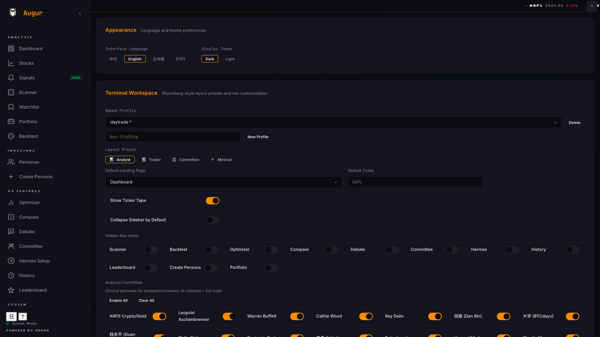
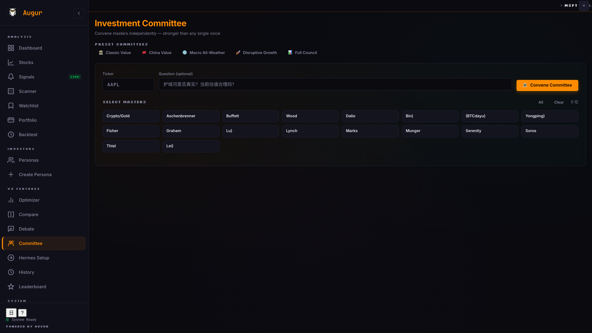

[🇨🇳 中文](README.md) | 🇺🇸 English

<div align="center">


# 🦉 Augur

**18 legendary investors. Same stock. One verdict.**

Put Warren Buffett, Ray Dalio, Duan Yongping and Cathie Wood in the same room — they won't agree. That's exactly the point.

[](https://github.com/BruceLanLan/augur/releases)
[](https://github.com/BruceLanLan/augur/actions)
[](#-18-investment-masters)
[](https://modelcontextprotocol.io)
[](#-dashboard)
[](LICENSE)

</div>

---

## 🚀 30-Second Quickstart

```bash
git clone https://github.com/BruceLanLan/augur.git && cd augur
pip install -e ".[data]"
augur serve --open          # Launch Dashboard
```

Or straight from the terminal:

```bash
augur analyze AAPL          # 18 masters in parallel
augur consensus NVDA        # Weighted consensus + Kelly sizing
augur workflow TSLA         # Full analysis pipeline in one call
```

---

## ✨ What's New in v10.0


### Your Personal Bloomberg Terminal

**The `/settings` page is now a full terminal configuration system:**



- **4 layout presets**: analyst / trader / committee / minimal — switch landing page and nav in one click
- **Named profiles**: save "day trading" and "weekend research" as separate configs, switch anytime
- **Master subset filter**: keep only the masters you trust in consensus — weights auto-renormalized
- Config lives in `~/.augur/workspace.yaml`, export/import to take it to a new machine

### AI Agents That Operate Your Terminal

Not just "chat" — your Claude / Hermes Agent can now **read and modify** your Augur workspace directly:

```python
# Call from Claude Desktop / Hermes / Claude Code:
mcp_augur_workspace_get()                       # see your current layout
mcp_augur_workspace_set(layout_preset="trader") # switch to trader mode
mcp_augur_workspace_profiles()                  # manage all profiles
```

### Full Analysis Pipeline in One Call

```bash
augur workflow NVDA --steps fetch,analyze,consensus,committee
```

`fetch → analyze → consensus → committee → debate → sentiment` — six steps chained, single-step failures don't break the chain, and default steps follow your active Profile.

---

## 📊 Dashboard


### Stock Analysis


Enter any ticker (US / HK / A-share). 18 masters respond with:
- **Augur Score** (0–10) + **BUY / NEUTRAL / SELL**
- **Kelly position sizing** (based on consensus confidence)
- **The Oracle of Augur**: one-line verdict
- Sentiment split: `13 Bullish / 5 Neutral / 0 Bearish`

### Investment Committee



Five preset committees, or build your own:
- **Classic Value**: Buffett · Graham · Munger · Fisher
- **China Value**: Duan Yongping · Zhang Lei · Li Lu · Dan Bin
- **Macro All-Weather**: Dalio · Soros · Marks · ARPS
- **Disruptive Growth**: Cathie Wood · Thiel · Aschenbrenner · Lynch
- **Full Council**: All 18 masters

### Bull / Bear Debate


Pick 2–4 masters to debate the same ticker across multiple rounds. Full bull and bear arguments generated automatically.

### History


Every analysis auto-archived. GitHub-style 52-week heatmap. Filter by signal, score, or date.

---

## 🎭 18 Investment Masters

> Four schools. Value / Growth / Macro / China. Chinese masters respond **in Chinese**.

| School | Masters |
|--------|---------|
| 🏦 Classic Value | Warren Buffett · Benjamin Graham · Charlie Munger · Philip Fisher |
| 🚀 Growth & Innovation | Peter Lynch · Cathie Wood · Peter Thiel · Leopold Aschenbrenner |
| 🌍 Macro & Cycles | Ray Dalio · George Soros · Howard Marks · ARPS Crypto/Gold |
| 🇨🇳 China Value | Duan Yongping · Zhang Lei (Hillhouse) · Li Lu (Himalaya) · Dan Bin · Dayu BTCdayu |
| ⚙️ Special | Serenity (AI compute supply chain) |

Each master has a dedicated [Hermes Skill](skills/) for direct persona chat.

---

## 🔌 Deploy Anywhere

| Platform | How |
|----------|-----|
| **Web Dashboard** | `augur serve` |
| **Claude Desktop** | MCP config → `augur mcp-server` |
| **Hermes Agent** | `/skill augur-buffett` |
| **Claude Code** | `.mcp.json` auto-discovery (clone and go) |
| **OpenClaw** | YAML manifest auto-registration |
| **Telegram / Slack** | `augur telegram` / `augur slack` |

### 13 MCP Tools

```json
// Claude Desktop
{
  "mcpServers": {
    "augur": { "command": "augur", "args": ["mcp-server"] }
  }
}
```

| Tool | Purpose |
|------|---------|
| `mcp_augur_analyze` | All-master or single-master analysis |
| `mcp_augur_consensus` | Weighted consensus + Kelly position |
| `mcp_augur_committee` | Committee (independent opinions + verdict) |
| `mcp_augur_debate` | Multi-round structured debate |
| `mcp_augur_workflow` | Full analysis pipeline |
| `mcp_augur_workspace_get` | 🆕 Read your terminal config |
| `mcp_augur_workspace_set` | 🆕 Modify your terminal config |
| `mcp_augur_workspace_profiles` | 🆕 Manage profiles |
| `mcp_augur_fetch` | Live market data |
| `mcp_augur_sentiment` | Social sentiment analysis |
| `mcp_augur_create_persona` | Create a custom master |
| `mcp_augur_list_personas` | List all masters |
| `mcp_augur_configure` | Set per-master model params |

---

## 💻 CLI Reference

```bash
# Analysis
augur analyze AAPL                              # 18-master consensus
augur analyze AAPL --persona buffett            # single master
augur consensus NVDA                            # weighted consensus + Kelly
augur workflow TSLA --steps fetch,analyze,consensus,committee

# Dashboard
augur serve --port 8000 --open

# Monitoring
augur watch AAPL NVDA TSLA                     # 60s refresh
augur watch NVDA --alert-above 7.5             # score threshold alert

# Portfolio
augur portfolio AAPL NVDA TSLA                 # Kelly allocation
augur backtest AAPL --days 30                  # historical backtest

# Agent
augur mcp-server                               # stdio MCP server
augur skills / augur skills --school value

# Bots
augur telegram / augur slack
```

---

## 🎨 Custom Personas

```bash
# Option 1: Dashboard no-code builder
augur serve  →  http://localhost:8000/create-persona

# Option 2: YAML
cat > personas/custom/my_quant.yaml << EOF
agent_id: my_quant
name: "My Quant Strategy"
philosophy: ["momentum", "value", "low_vol"]
scoring_weights:
  momentum: 0.40
  value: 0.35
  safety: 0.25
EOF
augur analyze AAPL --persona my_quant

# Option 3: MCP
mcp_augur_create_persona(yaml_content="agent_id: ...")
```

---

## 📝 Changelog

> Non-technical release notes: [docs/en/RELEASE_NOTES.md](docs/en/RELEASE_NOTES.md)

<details open>
<summary><strong>v10.0.0 — Terminal Workspace + Agentic Workflow + 13 MCP Tools + WebSocket Streaming (current)</strong></summary>

**v8 → v10 upgrade highlights:**

- 🆕 **Terminal Workspace**: Bloomberg-style multi-profile layout system with preset filters and master-subset controls
- 🆕 **3 workspace MCP tools**: agents can read/write your terminal config (`workspace_get/set/profiles`)
- 🆕 **`augur_workflow`**: 6-step pipeline, single-step failure isolation, steps follow your active Profile
- 🆕 **WebSocket streaming**: `/ws/workspace` state broadcast + `/ws/workflow` per-step progress
- 🆕 **augur-terminal meta-skill**: Hermes unified entry point — 13 tools, 15 pages, 4 presets
- 🆕 **Hermes committee.yaml**: Committee Chair agent role
- ✅ Consensus engine: industry weights · regime routing · MetaModel · point-in-time fundamentals
- ✅ Dashboard: 4-language i18n · History heatmap · PWA · keyboard shortcuts · CSV export
- ✅ 2136 tests passing
</details>

<details>
<summary><strong>v9.0.x — Hermes Agent + Committee System</strong></summary>

- 19 Hermes Skills; Chinese masters in Chinese
- 9 MCP tools (committee / sentiment / create_persona / debate)
- Committee presets + Hermes setup guide page
- PWA install + WebSocket Ticker Tape + Chat data cards
</details>

<details>
<summary><strong>v8.2.x — HD-2D Design System + Optimizer + AI Chat</strong></summary>

- Markowitz efficient frontier · Rules→Bot push · real LLM chat
- HD-2D design system: ExecCard / OracleSays / ScorecardGrid
- WCAG AA compliance · thread safety · scanner hardening
</details>

---

<div align="center">

MIT License · Built with ❤️ by <a href="https://github.com/BruceLanLan">BruceLanLan</a>

*For educational purposes only — not investment advice*

</div>
