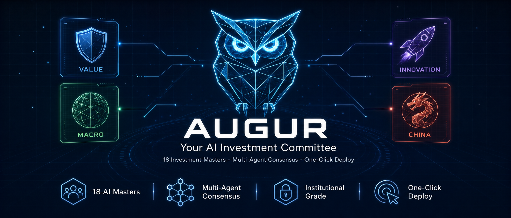
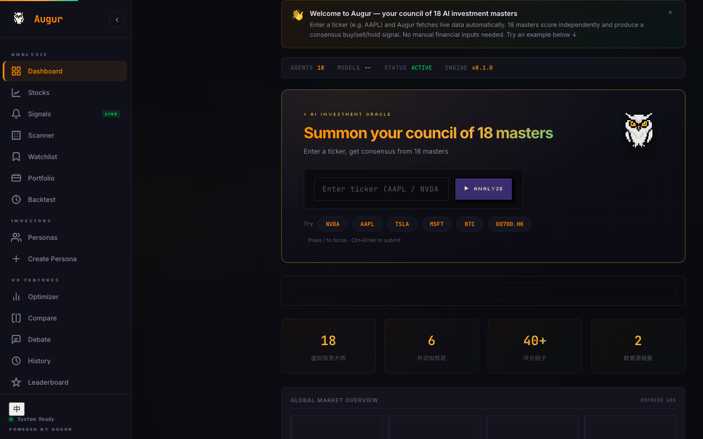
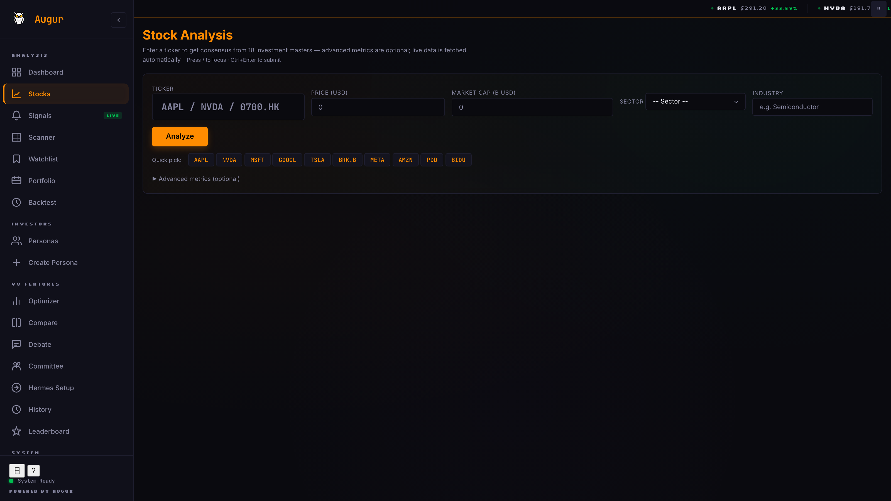
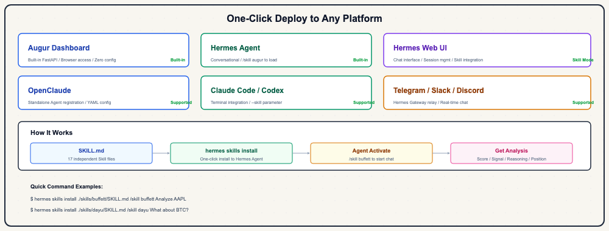

[🇨🇳 中文](README.md) | 🇺🇸 English

<div align="center">



# 🦉 Augur

**Your AI Investment Committee**

*18 legendary investors. Simultaneous analysis. One verdict.*

[](https://github.com/BruceLanLan/augur/releases)
[](https://github.com/BruceLanLan/augur/actions)
[](#-18-investment-masters)
[](https://modelcontextprotocol.io)
[](#-dashboard)
[](LICENSE)

</div>

---

## Why Augur?

| | Single Strategy / ChatGPT | **Augur** |
|---|---|---|
| Analytical perspectives | 1 | **18** (Value / Growth / Macro / China) |
| Quantitative scoring | ❌ | ✅ 0–10 score + Kelly position sizing |
| Bull/Bear debate | ❌ | ✅ Built-in structured debate |
| Investment committee | ❌ | ✅ Configurable preset committees |
| Real-time market data | ❌ | ✅ yfinance auto-fetch |
| AI conversation | Generic answers | ✅ Persona chat + live data cards |
| Portfolio optimization | ❌ | ✅ Markowitz efficient frontier |
| Multi-platform access | ❌ | ✅ Dashboard / MCP / CLI / Bot |
| DIY customization | ❌ | ✅ YAML no-code persona builder |
| Standalone install | ❌ | ✅ PWA — desktop / mobile app |
| **Terminal customization** | ❌ | ✅ Bloomberg-style layout profiles, save and switch between them |
| **Agent reads/writes your terminal** | ❌ | ✅ MCP agents can query and change your layout and enabled masters — not just chat |
| **Multi-step automated analysis** | ❌ | ✅ `augur_workflow`: fetch→analyze→consensus→committee→debate→sentiment in one call |

---

## 🎭 18 Investment Masters

### Classic Value School

| Master | Framework | Signature Question |
|--------|-----------|-------------------|
| Warren Buffett | Moat · Long-term hold · ROE | Will this company still have a competitive advantage in five years? |
| Benjamin Graham | Margin of safety · Deep value · P/B | How much cheaper is this than intrinsic value? |
| Charlie Munger | Lattice thinking · Inversion · Antifragility | Where are we most likely to be wrong? |
| Philip Fisher | Scuttlebutt · Growth quality · Management | Is this company investing aggressively in R&D? |

### Growth & Innovation

| Master | Framework | Signature Question |
|--------|-----------|-------------------|
| Peter Lynch | GARP · PEG · Everyday edge | Is PEG below 1? |
| Cathie Wood | Disruptive innovation · Wright's Law · AI | How big will this market be in five years? |
| Peter Thiel | 0→1 monopoly · Secrets · Contrarian | What does this company know that others don't? |
| Leopold Aschenbrenner | AGI infrastructure · Geopolitics · Compute | Where is the AI compute bottleneck? |

### Macro & Cycles

| Master | Framework | Signature Question |
|--------|-----------|-------------------|
| Ray Dalio | All-weather · Debt cycles · Correlation | How does this asset perform in stagflation? |
| George Soros | Reflexivity · Macro trading · FX | What is the self-reinforcing mechanism here? |
| Howard Marks | Pendulum · Second-level thinking | What does consensus think — and are they right? |
| ARPS | Real rates · Gold · Crypto | What is the inflation-adjusted yield? |

### 🇨🇳 Chinese Value School (full Chinese dialogue)

| Master | Framework | Signature Question |
|--------|-----------|-------------------|
| Duan Yongping 段永平 | Integrity (本分) · Extreme concentration | What is the true business nature of this company? |
| Zhang Lei 张磊 (Hillhouse) | Structural long-term value · Enablement | Can this company operate for 100 years? |
| Li Lu 李录 (Himalaya) | Deep value · Margin of safety | Is intrinsic value being severely underpriced? |
| Dan Bin 但斌 | Brand moat · Era beta | Is this one of the era's greatest companies? |
| BTCdayu 大宇 | Information edge · Sentiment momentum | What phase is market sentiment at? |

### Special Strategies

| Master | Framework |
|--------|-----------|
| Serenity | AI supply chain bottlenecks · Compute dependency analysis |

---

## 🚀 30-Second Quickstart

```bash
git clone https://github.com/BruceLanLan/augur.git && cd augur
pip install -e ".[data]"

# 18-master consensus on AAPL
augur analyze AAPL

# Weighted consensus + Kelly position
augur consensus NVDA

# Launch Web dashboard
augur serve --open
```

---

## 📊 Dashboard



Bloomberg Terminal × JRPG HD-2D aesthetic. Enter a ticker and 18 masters analyze simultaneously.

```bash
augur serve              # default http://localhost:8000
augur serve --port 8080  # custom port
docker compose up        # Docker one-command launch
```

Install as a standalone app (PWA): visit the dashboard in your browser and click "Install" in the address bar — works on desktop and mobile.

### Stock Analysis



Auto-fetches market cap, PE, ROE, FCF and more. 18 masters score independently, then merge into consensus:
- **Augur Score** (0–10) + **BUY / NEUTRAL / SELL**
- **Confidence** + **Kelly position sizing**
- **The Oracle of Augur**: one-line consensus verdict
- **13 Bullish / 5 Neutral / 0 Bearish**: sentiment distribution

### Bull / Bear Debate


Automatically generates a full bull and bear case to surface blind spots.

### Investment Committee

Select any combination of masters, convene a committee session — each master speaks independently and a verdict is auto-generated, then saved to history.

Preset committees: **Classic Value** · **China Value** · **Macro All-Weather** · **Disruptive Growth** · **Full Council**

### Terminal Workspace

Make the Dashboard your own, Bloomberg-terminal style:

- **Layout presets**: analyst (default) / trader / committee / minimal — switch default landing page, hidden nav items, and the Ticker Tape with one click.
- **Multiple named profiles**: save several named configs (e.g. "day trading" / "weekend deep research") and switch between them without losing the others.
- **Enabled-master subset**: keep only the masters you trust in the consensus calculation — weights are re-normalized automatically, not just split evenly.
- **Committee preset bound to profile**: switching profiles also switches your default committee lineup.
- Persisted to `~/.augur/workspace.yaml`, with export/import — take your terminal setup to a new machine.
- **Open to agents**: see "Deploy Anywhere" below — any MCP client can read and modify your workspace config without you touching the Dashboard.

### Personas


### History


Every analysis is auto-archived. Filter by date, score, or signal for retrospective review.

### All Pages

Dashboard / Stocks / Signals / Scanner / Watchlist / Portfolio / Backtest / AI Chat / Optimizer / **Committee** / Compare / Debate / History / Leaderboard / Personas / Create Persona / Hermes Setup / Settings (incl. **Terminal Workspace**)

---

## 🔌 Deploy Anywhere



| Platform | How to connect |
|----------|---------------|
| **Web Dashboard** | `augur serve` — built-in FastAPI, zero config |
| **Claude Desktop** | MCP config → `augur mcp-server` |
| **Hermes Agent** | `/skill augur-buffett` — direct persona chat |
| **OpenClaw** | YAML manifest auto-registration |
| **Telegram / Slack** | `augur telegram` / `augur slack` |
| **Claude Code / Codex** | `.mcp.json` auto-discovery |

### MCP Quick Setup

**Claude Desktop** (`~/Library/Application Support/Claude/claude_desktop_config.json`):
```json
{
  "mcpServers": {
    "augur": { "command": "augur", "args": ["mcp-server"] }
  }
}
```

**Hermes Studio** (`~/.hermes/config.yaml`):
```yaml
mcp_servers:
  augur:
    command: augur
    args: [mcp-server]
```

### MCP Tools (13 total)

| Tool | Purpose |
|------|---------|
| `mcp_augur_analyze` | Single or all-master analysis |
| `mcp_augur_consensus` | Weighted consensus + Kelly position |
| `mcp_augur_committee` | Investment committee (independent opinions + verdict) |
| `mcp_augur_debate` | Multi-round structured debate |
| `mcp_augur_fetch` | Real-time market data (yfinance) |
| `mcp_augur_sentiment` | Social sentiment (StockTwits + news) |
| `mcp_augur_list_personas` | List all 18 masters |
| `mcp_augur_configure` | Set per-master model parameters |
| `mcp_augur_create_persona` | Create a custom YAML persona |
| `mcp_augur_workflow` | Multi-step pipeline: fetch→analyze→consensus→committee→debate→sentiment |
| `mcp_augur_workspace_get` | Read your terminal layout / enabled masters / committee preset |
| `mcp_augur_workspace_set` | Modify your terminal layout on your behalf (e.g. switch to trader preset, restrict to value-school masters) |
| `mcp_augur_workspace_profiles` | List / create / delete / switch terminal profiles |

---

## 💻 CLI Commands

```bash
# Analysis
augur analyze AAPL                      # 18-master consensus
augur analyze AAPL --persona buffett    # single master
augur consensus NVDA                    # weighted consensus + Kelly
augur report TSLA                       # deep Markdown analysis report

# Live monitoring
augur serve --port 8000 --open          # launch Dashboard, auto-open browser
augur watch AAPL NVDA TSLA             # live monitor (60s refresh)
augur watch NVDA --alert-above 7.5     # alert when score crosses threshold

# Portfolio
augur portfolio AAPL NVDA TSLA         # Kelly-weighted allocation suggestion
augur watchlist-add AAPL               # add to watchlist
augur backtest AAPL --days 30          # historical backtest

# Agent / MCP
augur mcp-server                       # start MCP server (stdio, for Claude/Hermes)
augur workflow AAPL                    # multi-step pipeline: fetch→analyze→consensus→committee→debate→sentiment
augur workflow NVDA --steps fetch,analyze,consensus,committee --agents buffett,munger,dalio
augur skills                           # list all Agent skills
augur skills --school value            # filter by school

# Bots
augur telegram                         # start Telegram bot
augur slack                            # start Slack bot
```

---

## 🎨 Highly DIY — Custom Personas

```bash
# Option 1: Dashboard no-code builder (recommended)
augur serve
# visit http://localhost:8000/create-persona

# Option 2: YAML file
cat > personas/custom/my_quant.yaml << EOF
agent_id: my_quant
name: "My Quant Strategy"
philosophy: ["momentum", "value", "low_vol"]
scoring_weights:
  momentum: 0.40
  value: 0.35
  safety: 0.25
EOF
augur analyze AAPL --persona my_quant

# Option 3: Via MCP tool
mcp_augur_create_persona(yaml_content="agent_id: ...")
```

---

## 📝 Changelog

> For a more detailed, non-technical walkthrough of this release, see [docs/en/RELEASE_NOTES.md](docs/en/RELEASE_NOTES.md).

<details open>
<summary><strong>v10.16.7 — Fixed history page calendar heatmap + optimizer Sharpe/weight unit mismatch (current)</strong></summary>

- **History page's 52-week calendar heatmap never rendered**: the page requested `/api/history?page=1&per_page=365`, but the endpoint's paginated mode caps `per_page` at 100 and returns 400 above that — silently swallowed by an empty `.catch()`. Fixed by switching to the endpoint's existing unpaginated `limit` mode (`/api/history?limit=365`).
- **Portfolio optimizer's Sharpe ratio and optimal weights used mismatched units**: the optimizer works with daily returns internally, but subtracted an annual risk-free rate directly from them — making "excess return" strongly negative for nearly every asset, corrupting both the displayed Sharpe ratio (observed -1.44 where ~+2.0 was correct) and the max-Sharpe weight solution itself. Fixed by converting the risk-free rate to daily before use.
- Test coverage: full suite, 2100 passing.
</details>

<details>
<summary><strong>v10.16.6 — Significantly reduced (not fully fixed) committee / deep report freezing</strong></summary>

- **Same root cause, extended to the committee and deep-report code path**: `analyze_ticker` (`/api/analyze`), `report_ticker` (`/api/report`, the Deep Report endpoint), `api_committee` (`/api/committee`), `api_compare`, `api_debate`, `compare_personas`, `get_persona_opinion`, and `api_run_watchlist_analysis` — 8 endpoints — were also `async def` with zero `await` anywhere in their bodies, while internally calling blocking yfinance fetches and running all 18 personas' analysis synchronously. Converted all 8 to sync `def`.
- **`/ws/analyze` and `/ws/committee` can't be converted to sync `def`** (Starlette requires WebSocket routes to stay `async def`). Instead wrapped their blocking `fetch_market_context` calls in `run_in_threadpool`, so the network fetch no longer ties up the event loop during a streaming committee/analyze session.
- Fixed a related latent bug: `analyze_ticker`'s fire-and-forget rule-notification dispatch used `asyncio.get_event_loop().run_in_executor(...)`, which would have silently failed (swallowed by a broad `except Exception`) once the handler moved to a worker thread with no running loop. Replaced with a plain daemon thread, preserving the original fire-and-forget behavior without depending on an event loop.
- Extended the regression-guard test to cover all 19 affected handlers (up from 11).
- **Known limitation**: live testing found this turns "the entire server completely freezes" into "other requests are delayed 3+ seconds" — root cause is that the 18 personas' analysis is CPU-bound, and moving CPU-bound work into a thread pool doesn't escape Python's GIL, so it still can't run truly in parallel. A full fix needs either a faster analysis path or a move to multiple processes; documented as a known limitation for now, see [CHANGELOG.md](CHANGELOG.md).
</details>

<details>
<summary><strong>v10.16.5 — Fixed unclickable homepage dashboard / widgets stuck loading</strong></summary>

- **Fixed the event loop being blocked by synchronous yfinance calls**: 11 endpoints — sector-performance, crypto-overview, commodities, treasury-rates, hot-tickers, single-ticker fetch, search, sparkline, market-overview, market-movers, and fear-greed — were declared `async def` but performed blocking synchronous yfinance/augur.data calls inside. On the single-process uvicorn server this froze the entire event loop, stalling every other concurrent request (including ones triggered by user clicks) — the root cause behind "dashboard won't respond to clicks" and "data not showing up" reports. Changed all of them to sync `def` so Starlette dispatches them to its threadpool instead of running them on the event loop thread.
- **Sector-performance now fetches in parallel with a bounded timeout**: previously fetched all 11 sector ETFs sequentially with no timeout or fallback, measured at 9.8s–15s+ (sometimes timing out completely) in isolation. Now fetched concurrently via a thread pool with a 10s per-symbol timeout, degrading individual symbols to 0 instead of stalling the whole response.
- Reproduced and verified the fix with a real headless browser (Playwright): firing a slow and a fast request concurrently showed both dragged to the same latency before the fix (proof of blocking) and fully decoupled after; the homepage now finishes loading all widgets within 15s with no stuck loading skeletons.
- Added new tests, including a structural regression test asserting all 11 handlers must remain sync `def`, to catch any future reintroduction of `async def`.
</details>

<details>
<summary><strong>v10.16.4 — Fixed committee Kelly position-size display bug</strong></summary>

- **Fixed double-scaled position percentage in `/api/committee` and `/ws/committee`**: `position_pct` is already a percentage at the consensus layer (e.g. 19.9 means 19.9%), but the committee endpoints multiplied it by 100 again, displaying nonsense like "1990.0%". Both call sites now use the value directly.
- Added regression tests covering `kelly_pct` on both the REST and WebSocket paths to prevent this from recurring.
</details>

<details>
<summary><strong>v10.16.3 — Workflow steps now follow your terminal layout preset</strong></summary>

- **`augur_workflow` default steps follow the active layout preset**: no longer hardcoded to `fetch,analyze,consensus`. When `--steps` (CLI), `steps` (MCP `augur_workflow`), or the `/api/workflow` body field is left empty, it now resolves from the active profile's layout preset — `analyst`=`fetch,analyze,consensus`, `trader`/`minimal`=`fetch,consensus` (faster signal), `committee`=`fetch,analyze,consensus,committee`. Passing `--steps` explicitly still overrides this.
- **Closes the loop between customization and agentic behavior**: the layout you pick in `/settings` now also changes how an agent's `augur_workflow` calls behave by default, not just what the Dashboard displays.
</details>

<details>
<summary><strong>v10.16.2 — Workflow partial-failure resilience + workspace ETag</strong></summary>

- **`augur_workflow` no longer aborts on a single step's failure**: if analyze / consensus / committee throws, the error is captured in that step's result (`{"error": ...}`) and the remaining steps still run; the summary now has a "Step Errors" section so failures are visible at a glance.
- **`mcp_augur_workspace_get` supports conditional requests (ETag)**: clients can pass back the previous ETag and get a 304 when the config hasn't changed, avoiding unnecessary full transfers.
- **Doc correction**: fixed the status of P1-8 (user feedback path) in `docs/AGENT_PEER_REVIEW_SYNTHESIS.md` — it was already shipped in v10.15.0's third consensus round (`USER_FEEDBACK_DIR` override precedence), not actually pending.
</details>

<details>
<summary><strong>v10.16.1 — MCP terminal workspace tools + committee-preset wiring</strong></summary>

- **`mcp_augur_workspace_get/set/profiles`**: Any MCP client (Claude Desktop / Hermes / OpenClaw) can now read and modify your Dashboard terminal layout, enabled-master subset, and committee preset on your behalf — the agent is no longer just a Q&A assistant, it can sense and operate your workspace.
- **Configurable consensus blending**: The MetaModel median blend is no longer a hidden fixed 50/50 — tune it via `consensus.meta_model_weight` (0 disables it entirely).
- **Committee page now reads your workspace**: visiting `/committee` auto-applies your saved committee preset instead of requiring a manual click every time.
- **Persona manifest/Hermes config version sync**: all 18 masters' `manifest.json` / Hermes yaml now track the live version instead of a stale hardcoded one, with the full 13-tool list documented.
- **Code-review fixes**: timeout-branch mismatch, cache concurrency locking, doc/manifest tool-count drift.
</details>

<details>
<summary><strong>v10.14.0–10.15.1 — Terminal Workspace + agentic workflow + consensus engine</strong></summary>

- **Terminal Workspace** (`/settings`): Bloomberg-style layout presets (analyst/trader/committee/minimal), multiple saved profiles, hidden nav, Ticker Tape toggle, config export/import.
- **`augur_workflow`**: one call chains fetch→analyze→consensus→committee→debate→sentiment, with `enabled_personas` scoping support.
- **Consensus enhancement modules** (`augur.consensus`): industry-matrix weighting, market-regime routing, probability calibration, rolling IC, macro features, risk management.
- **Agent Peer Review**: an internal 9-track self-review process that fixed persona weight re-normalization, server-side landing redirect, workflow dedup, and more.
</details>

<details>
<summary><strong>v10.0.0–10.13.0 — Internationalization + Dashboard UX polish</strong></summary>

- **Four-language i18n**: added Japanese/Korean, cyclable zh/en/ja/ko switching with fallback chain.
- **Charts and exports**: factor breakdown table, Performance IC bar chart, CSV export across Signals/Backtest/Scanner/Optimizer, Committee/Debate report copy and download.
- **History calendar heatmap**: GitHub-style contribution graph showing analysis activity, click a date to filter.
- **UX details**: keyboard shortcuts help panel (`?`), recent-analysis chips, URL state sync, one-click watchlist add from Scanner/Stocks, cross-page ticker navigation from Signals/History.
- **`augur-mcp` standalone entry point**: a dedicated stdio entry point for desktop MCP clients like Hermes Studio / Claude Desktop to spawn directly.
</details>

<details>
<summary><strong>v9.0.6 — PWA installable standalone app</strong></summary>

- **PWA support**: Dashboard can be installed as a standalone app on desktop or mobile, with offline caching for the core UI.
- **Ticker Tape**: Real-time price scrollbar at the top of the home page (WebSocket-driven, supports pause / auto-reconnect).
- **Chat data cards**: Live market data card embedded at the top of the AI chat page — Augur consensus signal refreshes every 60 seconds.
</details>

<details>
<summary><strong>v9.0.x — Hermes Agent + Committee system</strong></summary>

- **19 handcrafted Hermes Skills**: Each master has a full persona-specific system prompt; Chinese masters respond in full Chinese.
- **9 MCP tools**: Added committee / sentiment / create_persona / debate.
- **Committee presets**: One-click load of Classic Value / China Value / Macro All-Weather / Disruptive Growth / Full Council.
- **Hermes Setup page** (`/hermes-setup`): Step-by-step integration guide with one-click code copy.
- **.mcp.json auto-discovery**: Claude Code and any MCP client auto-discover all tools.
- **`augur serve / watch / skills / portfolio` CLI**: Full command-line toolset.
- **install.sh one-liner**, Docker v9, Makefile v2.
</details>

<details>
<summary><strong>v8.2.x — Optimizer + Rules→Bot + AI Chat</strong></summary>

- **Optimizer efficient frontier**: Markowitz scatter + line chart, gold star for optimal portfolio, green dots per asset.
- **Rules→Bot**: Alert rules automatically push to Telegram / Slack / WeChat / Lark when triggered (fire-and-forget).
- **AI Chat upgrade**: Real LLM support (claude-opus-4-8), multi-turn history, ⚡LLM / 📋 template badges.
- **Scanner hardening**: Case-insensitive dedup, single-ticker failure doesn't abort batch.
- **Backend thread safety**: Double-checked locking, atomic history writes, `_write_lock`.
- **WCAG AA contrast compliance**, CSS variable full coverage.
</details>

<details>
<summary><strong>v8.2.0 — HD-2D design system launch</strong></summary>

- AI Chat (11 masters), Portfolio Optimizer, Committee, Debate, History, Leaderboard — all shipped.
- LearningEngine (IC-based auto weight tuning), SentimentAnalyzer (social sentiment fusion).
- WebSocket real-time price stream `/ws/prices`, RulesEngine DSL multi-channel alerts.
- HD-2D design system: ExecCard / OracleSays / ScorecardGrid components, responsive breakpoints, bilingual number formatting.
</details>

---

<div align="center">

MIT License · Built with ❤️ by <a href="https://github.com/BruceLanLan">BruceLanLan</a>

*For educational purposes only — not investment advice*

</div>
