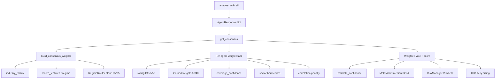

# Peer Review #3 — Consensus Engine

**Reviewer lens:** quantitative finance (weight calibration, regime detection, ensemble risk)  
**Scope:** `src/augur/consensus/*`, `registry.py` (`analyze_with_all`, `get_consensus`), `workflow.py` consensus step, `workspace.enabled_personas`, `feedback/*.example`  
**Date:** 2026-06-22

---

## Executive summary

The consensus stack is a credible **multi-signal ensemble** with industry tilts, macro regime overlay, rolling IC, learned weights, correlation penalty, calibration, and Kelly sizing. Architecturally it mirrors a buy-side **committee model**: sector specialists plus macro overlay plus post-trade risk veto.

Two structural gaps stand out from a quant lens:

1. **Weight calibration is layered but not jointly identified** — five independent overlays (industry matrix, regime router, rolling IC, LearningEngine, sector hard-codes in `get_consensus`) stack without a single normalization pass or out-of-sample objective.
2. **Regime detection is a coarse rule-of-thumb** — VIX threshold + 10-day SPY SMA — adequate for UX labeling, insufficient for risk budgeting or dynamic factor tilts without hysteresis and validation.

**Fix implemented in this review:** removed double-counting of regime multipliers in `build_consensus_weights()` (see §7).

---

## Architecture map



---

## Weight calibration (quant lens)

### What works

| Layer | Source | Role |
|-------|--------|------|
| Industry base | `industry_matrix.py` + `feedback/industry_matrix.json` | Sector factor tilt — analogous to GICS-conditioned factor loadings |
| Global fallback | `feedback/weights.json` | Prior when industry key missing |
| Regime overlay | `RegimeRouter` 35% blend | Macro state conditioning (Marks/Dalio up in high vol) |
| Rolling IC | `rolling_ic.json` | Empirical skill weighting — closest to true **IC-weighted ensemble** |
| Learned | `LearningEngine` | Online adaptation from recorded predictions |
| Diversity | `agent_correlation.json` | Penalizes redundant signals (ρ > 0.7) — reduces **effective N** inflation |

The `feedback/*.example` files are well-structured for committee-driven calibration: normalized relative weights per industry, global prior with provenance fields (`updated_at`, `source`). This is the right hook for backtest-driven rebalancing.

### What is weak

1. **No joint re-normalization after the per-agent stack** in `get_consensus` — industry weight → IC blend → learned blend → coverage multiplier → sector boost → correlation penalty. Each step changes magnitude; only the industry/regime stage normalizes to 1.0. Residual weights are not guaranteed to sum to 1 before the vote, so **effective exposures drift** with how many overlays fire.

2. **Sector boosts duplicated** — `build_consensus_weights` already encodes tech/financial/healthcare tilts via `industry_matrix`; `get_consensus` lines 387–404 apply a second hard-coded sector multiplier (`cathie_wood × 1.3` in tech). This is **double counting the same economic prior**.

3. **MetaModel is a median stub** — `MetaModel.predict()` returns the unweighted median agent score and blends 50/50 into consensus score. Without training or cross-validation, this is **shrinkage toward the cross-sectional median**, not a stacked generalization model. It dampens extremes but adds no information.

4. **Probability calibrator is heuristic** — `calibrate_confidence` scales by score extremity (`0.85 + 0.15 × |score−5|/5`). There is no Platt scaling, isotonic regression, or Brier-score objective tied to `LearningEngine` outcomes.

5. **Rolling IC path split** — `rolling_ic.py` falls back to `~/.augur/rolling_ic.json` while other feedback lives under repo `feedback/`. Operational risk: **production weights may diverge from committed feedback** without visibility.

---

## Regime detection quality

`macro_features.fetch_macro_features()` implements:

- **VIX:** latest close (5-day history)
- **Trend:** SPY last close vs 10-day SMA (±2% bull/bear bands)
- **Regime:** 2×2 grid (trend × VIX ≥ 25)

### Strengths

- Simple, fast, no lookahead if used point-in-time with `date_str` (though `date_str` is rarely passed from callers).
- Regime labels map cleanly to `_REGIME_ADJUSTMENTS` personas (defensive up in bear/high-vol).

### Weaknesses (quant)

| Issue | Impact |
|-------|--------|
| Single VIX threshold (25) | No vol term structure; misses vol-of-vol and regime persistence |
| 10-day SMA on SPY | Very short horizon; whipsaws in choppy markets → **regime flicker** |
| No hysteresis | BULL ↔ SIDEWAYS boundary noise propagates into weight jumps every call |
| `date_str` unused in yfinance fetch | Backtests cannot replay historical regime without code change |
| Default fallback VIX=20, SIDEWAYS | Silent prior when data unavailable — masks data failures |

For production risk budgeting, this regime signal should be treated as a **UI label**, not a validated state variable. A HMM or Markov-switching model on (VIX, term spread, credit spread) with minimum dwell time would be the next maturity step.

---

## `get_consensus` review highlights

**Positive:** ERROR agents excluded; low-participation flag when &lt;3 valid agents; all-bullish overvaluation warning; finite score/confidence guards; timing metadata; auto-records predictions for learning loop.

**Concerns:**

- `default_weight = 1.0 / valid_count` when agent absent from weight dict — correct equal-weight fallback, but **does not renormalize industry weights to the participating subset** when `enabled_personas` filters agents. A 3-agent subset still inherits weights computed for the full 18-agent universe if those agents appear in the matrix.
- Sentiment factor applied post-weighting (`±0.5` on score) — mixes an exogenous signal after ensemble aggregation without confidence adjustment.
- Kelly block uses half-Kelly with ad-hoc edge mapping; bearish always 0% — reasonable conservative default but not tied to calibrated win probability.

---

## `analyze_with_all` & `enabled_personas`

Dashboard and MCP correctly pass `get_enabled_personas()` into `analyze_with_all`. Filtering is clean: unknown IDs ignored, empty list = all agents, empty result when all IDs invalid.

**Gap:** consensus weighting is **persona-unaware**. Weights are built for the full agent universe; filtered runs do not call `restrict_weights_to_agents`. A user selecting `{buffett, graham, marks}` gets equal-weight fallback for agents outside the industry matrix keys, while matrix mass sits on agents that never ran.

---

## Workflow consensus step

`workflow.run_workflow()`:

- Does **not** read `workspace.enabled_personas` — always calls `analyze_with_all(ctx)` without filter.
- Supports CLI `--agents` for manual subset, but that path bypasses the coordinator and runs `agent.analyze` sequentially (no timeout, no ERROR envelope parity).
- `debate` step calls `run_debate()` which internally re-runs `analyze_with_all` **without** persona filter or prior `responses` reuse — duplicate work and inconsistent with analyze/consensus steps.
- Consensus output omits `regime`, `low_participation`, and `position_sizing` metadata present in full API responses.

---

## Feedback examples review

| File | Assessment |
|------|------------|
| `feedback/weights.json.example` | Good global prior template; weights sum ≈ 1.0; includes metadata fields for audit trail |
| `feedback/industry_matrix.json.example` | Sensible sector splits; tech overweight on growth agents, financial on value — aligns with economic intuition |

**Missing examples:** `agent_correlation.json.example`, `rolling_ic.json.example`. Operators cannot copy-paste the full calibration stack without reading source.

---

## Three recommended consensus improvements

### 1. Persona-aware weight renormalization

After building weights, restrict and renormalize to `results.keys()` before the per-agent stack:

```python
weights = restrict_weights_to_agents(weight_ctx.weights, list(results.keys()))
```

Without this, filtered committees are **not mean-variance equivalent** to full committees scaled down — they are a different portfolio.

### 2. Unified calibration pipeline with OOS objective

Replace stacked heuristics with a single fit step:

- Train industry + regime + IC weights jointly on `LearningEngine` prediction outcomes (Brier or directional hit rate).
- Persist fitted weights to `feedback/` with train/test window metadata.
- Disable hard-coded sector boosts in `get_consensus` once matrix is fitted.

This moves from **hand-tuned factor tilts** to **identified ensemble weights**.

### 3. Regime detector v2 with persistence

- Add minimum dwell (e.g. 5 sessions) before regime label changes.
- Pass `date_str` through to yfinance `start`/`end` for reproducible backtests.
- Expose `regime_confidence` (distance from threshold, vol percentile) in metadata for position sizing scaling.

---

## Two critiques: workflow & persona filter

### Critique 1 — Workflow ignores workspace persona contract

Users who configure `enabled_personas` in Settings get filtered analysis on `/api/analyze` but **full 18-agent runs** via `augur workflow`, MCP `augur_workflow`, and `/api/workflow`. The workspace field becomes a dashboard-only preference, breaking the mental model of "my committee." Fix: import `get_enabled_personas()` in `run_workflow()` and pass through unless `--agents` overrides.

### Critique 2 — Persona filter silently degrades consensus quality

When all `enabled_personas` IDs are unknown, `analyze_with_all` returns `{}` and `get_consensus` emits NEUTRAL/confidence 0 with "No results" — correct but silent. When 1–2 valid IDs are selected, consensus runs with `low_participation` capped confidence but **no user-facing warning** in workflow JSON output. A quant desk would reject any ensemble with effective N &lt; 3; the product should surface this explicitly in workflow/consensus responses, not only in metadata.

---

## Fix implemented (this review)

**File:** `src/augur/consensus/weighting.py`

**Problem:** `build_consensus_weights()` applied regime twice:

1. `apply_regime_weights()` — multiplies industry weights by `_REGIME_ADJUSTMENTS`
2. `_blend_weight_maps(..., RegimeRouter, 0.35)` — blends the same multipliers again

Both draw from the same `_REGIME_ADJUSTMENTS` table, **double-counting macro tilts** (e.g. Marks weight inflated by ~1.2² effective exposure in BEAR_HIGH_VOL).

**Change:** Removed the `apply_regime_weights` call; regime is applied once via the 65/35 industry/router blend. Also removed redundant second `fetch_macro_features` call via `detect_regime(date_str)`.

**Expected effect:** Regime conditioning is smoother and economically interpretable as a single 35% macro overlay on sector weights, rather than compounded multipliers.

---

## Test plan

```bash
python3 -m pytest tests/test_v10_14_workspace_workflow.py::TestConsensusModules -q
python3 -m pytest tests/test_enabled_personas_v10_15.py -q
python3 -m pytest tests/test_registry.py::TestDecisionCoordinator -q
```

Manual: run consensus on a tech ticker in a high-VIX session; verify `reasoning` regime note unchanged but score/weight distribution shifts modestly vs pre-fix (less aggressive defensive tilt).

---

## Verdict

**Ship with caveats.** The consensus engine is thoughtfully layered and already exceeds typical "voting chatbot" patterns. Before treating outputs as risk inputs, address persona-aware renormalization, workflow persona parity, and regime validation. The feedback example files are a good foundation — extend them to correlation and IC artifacts and wire a single OOS calibration loop.
