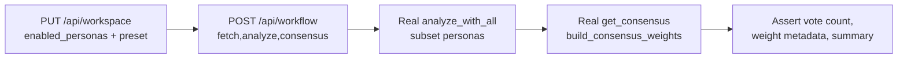

# Peer Review #6 — QA & Testing (v10.14 / v10.15)

**Reviewer focus:** test coverage, flake risk, and end-to-end gaps for workspace, workflow, and consensus integration.  
**Scope:** `tests/test_*v10_14*.py`, `tests/test_*v10_15*.py`, and related new features in `src/augur/workspace.py`, `src/augur/workflow.py`, `src/augur/consensus/{paths,weighting}.py`, dashboard workspace APIs, CLI/API/MCP workflow surfaces.

---

## Executive summary

v10.14–v10.15 added substantial surface area (multi-profile workspace, enabled personas, first-class workflow CLI/API/MCP, consensus weighting orchestration, i18n, scanner decoupling guardrails). The test suite grew from ~50 unit/API tests to ~230 parametrized cases, but **integration depth remains shallow**: most workflow and consensus paths are validated through mocks, and the three pillars—**workspace → workflow → consensus**—are never exercised as a single chain.

Overall quality is **good for regression guards and UI string completeness**, **weak for behavioral integration and new-module coverage**. No tests currently target `build_consensus_weights`, `paths.py`, multi-profile workspace APIs, or export/import bundles.

---

## Test inventory (v10.14 / v10.15)

| File | Focus | Approx. tests | Integration depth |
|------|--------|---------------|-------------------|
| `test_v10_14_workspace_workflow.py` | Workspace presets, consensus smoke, workflow steps, dashboard workspace API | ~30 | Low–medium (workflow heavily mocked) |
| `test_workflow_cli_v10_15.py` | CLI help, JSON output, API/MCP handlers | ~15 | **Very low** (always patches `run_workflow`) |
| `test_e2e_agentic_v10_15.py` | Named “e2e” but mocks coordinator + fetch | ~15 | Low (misleading label) |
| `test_enabled_personas_v10_15.py` | Persona filter in `analyze_with_all`, workspace persistence, dashboard analyze wiring | ~10 | Medium for dashboard analyze only |
| `test_i18n_workspace_v10_15.py` | i18n key parity (zh/en/ja/ko), settings.html refs | ~90 parametrized | Static analysis only |
| `test_no_scanner_imports_v10_15.py` | Repo-wide import guard | ~N files | Static analysis only |

---

## Coverage gaps

### 1. Workspace multi-profile (v10.15 expansion)

`workspace.py` gained `list_profiles`, `create_profile`, `delete_profile`, `set_active_profile`, `save_profile`, `import_workspace_bundle`, `export_workspace_bundle`, `resolve_landing_url`, and flat-YAML migration (`_migrate_flat_to_profiles`). **None of these have dedicated tests.**

Existing workspace tests patch `_workspace_path` but only touch the active profile via `save_workspace`. Risks:

- Profile create/delete/switch errors (duplicate name, delete active, delete last) untested.
- Legacy flat `workspace.yaml` migration may silently drop fields.
- Export/import merge vs replace semantics untested.
- Dashboard endpoints `/api/workspace/profiles`, `/api/workspace/active`, `/api/workspace/export|import` untested.

### 2. Consensus weighting orchestration (new in v10.15)

`consensus/paths.py` and `consensus/weighting.py` introduce `load_feedback_json`, `build_consensus_weights`, and `_blend_weight_maps`. **Zero direct tests.**

Existing consensus tests hit leaf modules (`industry_matrix`, `regime_weights`, etc.) in isolation. `get_consensus` in `registry.py` calls the full stack, but every workflow/consensus test **patches `DecisionCoordinator.get_consensus`**, so the orchestration layer never runs in workflow tests.

Gap impact: regressions in blending (35% router overlay), feedback JSON loading, or industry detection wiring would not fail CI.

### 3. Workspace ↔ workflow ↔ consensus integration

Critical missing chain:

```
User sets enabled_personas in workspace
  → Dashboard /api/analyze passes get_enabled_personas()     ✓ tested
  → run_workflow() respects workspace personas               ✓ wired in code, ✗ not in v10_15 suite
  → CLI `augur workflow` respects workspace personas         ✓ via run_workflow, ✗ not tested through CLI
  → get_consensus uses subset agent weights correctly        ✗ NOT tested end-to-end
```

`run_workflow` reads `get_enabled_personas()` when the `agents` CLI string is empty and exposes `agents_filter` in output. **No test in the v10_15 files verified this wiring** until `test_peer_review_qa_v10_15.py`. Precedence when both `--agents` and workspace personas are set: explicit `--agents` wins (workspace filter skipped).

### 4. Workflow surfaces test only the shell

`test_workflow_cli_v10_15.py` and MCP/API tests patch `augur.workflow.run_workflow` entirely. They verify argument parsing, exit codes, and response shape—but **never** that `run_workflow` is invoked with correct arguments from each entry point, or that results propagate without the mock.

### 5. Dashboard cross-feature e2e

No test covers:

- Settings save → reload page → `/api/workspace` reflects personas → `/api/analyze` uses them (partial: analyze patch test exists, no reload/isolation).
- Preset apply → `resolve_landing_url` redirect behavior (function unused in dashboard tests).
- Workflow dashboard endpoint (workflow lives on `augur.api`, not `dashboard.app`; no cross-app test plan).

### 6. Negative and edge paths

| Area | Missing cases |
|------|----------------|
| Workspace | Invalid profile names, concurrent saves, corrupt YAML, `enabled_personas` with only invalid IDs through full API |
| Workflow | Empty analyze results → consensus "No results"; all agents ERROR; step order dependencies (consensus without analyze) |
| Consensus | Missing/corrupt `feedback/*.json`; empty weight maps; `restrict_weights_to_agents` when persona subset active |
| i18n | Drift between `i18n.js` and `{en,zh}.json` key sets; no test that runtime JS loader matches JSON files |

### 7. Duplication without added signal

Consensus industry/regime normalization (`sum ≈ 1.0`) appears in both `test_v10_14_workspace_workflow.py` and `test_e2e_agentic_v10_15.py`. Workflow committee voting logic is tested twice (v10_14 + e2e). Duplication inflates count without increasing branch coverage.

---

## Flaky-test risks

### Shared global state

| Risk | Location | Mitigation in suite | Residual risk |
|------|----------|---------------------|---------------|
| Workspace in-memory cache (`_workspace_state`, `_workspace`) | `workspace.py` | Most tests patch path + reset cache | **Dashboard API tests in v10_14 do not isolate storage**—they write to shared `TestClient(app)` and real default path unless patched |
| `DecisionCoordinator` singleton timing (`_last_analysis_ms`) | `registry.py` | Documented as acceptable | Parallel pytest (`-n`) could cause cross-test interference if any test reads telemetry |
| IP rate limits | `dashboard/app.py` | `conftest.reset_ip_rate_limits` autouse fixture | Good |
| `MetaModel.load()`, `load_rolling_ic_weights()` | consensus tests | Hit filesystem / bundled models | Fragile if model artifacts change; no temp isolation |
| `fetch_macro_features()` | v10_14 consensus test | Patched in one test; **e2e consensus tests don't patch** | Potential network/yfinance flake if patch missed |
| i18n.js regex parser | `test_i18n_workspace_v10_15.py` | Fragile to formatting changes in JS file | False failures on unrelated JS edits |

### Misleading test labels

`test_e2e_agentic_v10_15.py` is not end-to-end—it mocks `fetch_market_context`, `analyze_with_all`, and `get_consensus`. Future contributors may assume green e2e implies production-safe integration.

### Parametrize explosion

i18n tests generate ~90 cases from static key lists. Failures are noisy (one missing key → 4 failures). Consider consolidating to schema-validation tests.

---

## Missing e2e: workspace + workflow + consensus

Recommended **minimum integration scenario** (not yet present):



**Acceptance criteria for a true e2e test:**

1. Isolated temp `workspace.yaml` (patch `_workspace_path`).
2. Patch only **external I/O** (`fetch_market_context`, optional `fetch_macro_features`)—not `DecisionCoordinator` methods.
3. Set `enabled_personas: ["buffett", "marks"]` via workspace API.
4. Run `run_workflow(ticker, steps="fetch,analyze,consensus")` with **no** `--agents` override.
5. Assert exactly 2 analyze entries, consensus score reflects real weighting (not mock), summary string contains both agent names.

Secondary e2e: multi-profile switch changes which personas flow to analyze without restart.

---

## Feature-area critique #1: Workflow CLI / API / MCP (`test_workflow_cli_v10_15.py`)

**Strengths**

- Good coverage of CLI UX: help text, `--json` stripping summary, invalid step exit code 1.
- API validation for bad ticker and propagated `ValueError`.
- MCP tool error strings mirror CLI.

**Weaknesses**

1. **100% mock of core logic**—file could be renamed `test_workflow_cli_contract.py` without loss of accuracy.
2. **No spy on `run_workflow` arguments**—regressions in parameter forwarding (`steps`, `agents`, `question`) would not be caught.
3. **No test that `--agents` and workspace personas interact** (precedence rules undefined).
4. **API auth** (`AUGUR_API_TOKEN`) only deleted, never tested with token required.
5. **No test for default steps** through CLI (only module-level `parse_steps`).

**Recommendation:** Add one integration test per surface that spies on `run_workflow` (not mocks return value) and asserts call kwargs. Add one unmocked `run_workflow` test with patched fetch only.

---

## Feature-area critique #2: Enabled personas (`test_enabled_personas_v10_15.py`)

**Strengths**

- Clear unit tests for `analyze_with_all` filtering (empty = all, subset, unknown IDs).
- Workspace normalization strips non-string persona entries.
- Dashboard `/api/analyze` test captures `enabled_personas` kwarg via spy—best integration test in v10.15.

**Weaknesses**

1. **Workflow persona wiring untested in v10_15 suite**—`run_workflow` reads `get_enabled_personas()` but no original test spied on `analyze_with_all`; fixed in peer-review test file.
2. **`get_consensus` weight restriction untested**—when personas are subset, industry weights should be restricted to active agents (`restrict_weights_to_agents` in registry); no test verifies buffett-only workspace doesn't inherit cathie_wood industry boost.
3. **Thread-pool behavior untested**—filter reduces agent count but timeout/error paths with filtered set not covered.
4. **Dashboard endpoints beyond analyze**—debate, committee, batch analyze also call `get_enabled_personas()` in `app.py`; only analyze tested.
5. **No API negative test**—saving 20 invalid persona strings should persist as `[]` and cause analyze to run all agents; behavior unverified through HTTP.

**Recommendation:** Extend persona tests to committee/debate routes; add consensus test with 2-agent subset and real `get_consensus`; add workflow integration once product wires `get_enabled_personas()`.

---

## Feature-area critique (honorable mention): i18n (`test_i18n_workspace_v10_15.py`)

Thorough for preventing untranslated settings UI. However, it tests **file contents**, not runtime behavior (`window.I18N` vs JSON loader). ja/ko tested in JS but not in JSON files. Low flake but high maintenance when keys are renamed.

---

## Recommended high-value additions

Added in `tests/test_peer_review_qa_v10_15.py` (peer-review deliverable):

1. `load_feedback_json` missing/invalid file handling
2. `build_consensus_weights` tech vs defensive weight ordering (mocked macro only)
3. Multi-profile workspace lifecycle (create → switch → persist)
4. Legacy flat YAML migration
5. `resolve_landing_url` ticker vs page precedence
6. Real `get_consensus` with industry weighting (mock macro, no coordinator mock)
7. Workspace export/import round-trip
8. Dashboard profile API lifecycle
9. **Workflow reads workspace `enabled_personas`** when `--agents` omitted (spy on `analyze_with_all`)
10. `load_global_consensus_weights` parsing

---

## Priority backlog (post-review)

| Priority | Test | Rationale |
|----------|------|-----------|
| P0 | Workspace → workflow persona propagation + e2e | Wired in code; needs unmocked coordinator test through CLI/API |
| P0 | Unmocked `run_workflow` through CLI (patch fetch only) | Catches step wiring regressions |
| P1 | Multi-profile API error cases | New v10.15 API surface |
| P1 | `get_consensus` with persona subset + weight restriction | Correctness of consensus on filtered agents |
| P2 | Dashboard debate/committee persona passthrough | Same bug class as analyze |
| P2 | Consolidate duplicate consensus smoke tests | Reduce noise |
| P3 | i18n JSON ↔ JS key parity | Prevent split-brain translations |

---

## Conclusion

The v10.14/v10.15 test suite successfully guards presets, static i18n, scanner import policy, and workflow **contracts**. It does **not** yet prove that workspace preferences flow through agentic analysis or that the new consensus orchestration layer behaves correctly under real coordinator calls.

**Verdict:** Adequate for merge of isolated features; **not adequate** for claiming integrated terminal/workflow readiness. Address P0 unmocked workflow tests and persona-weight e2e before marketing workflow as workspace-aware.
